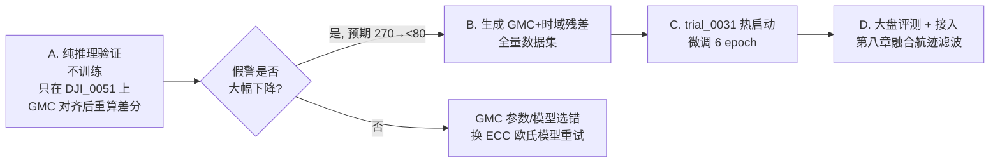

不查代码，纯从方法论和领域经验给你判断。

## 结论先行：优先级排序

| 排序 | 方向 | 攻克目标 | 预期召回增益 | 成本 | 风险 |
|:--|:--|:--|:--|:--|:--|
| **P0** | 零成本诊断：漏检样本的"亚阈值响应存在率" | 全部 | — | 半天 | 无 |
| **P1** | **GMC 全局运动补偿 + 时域背景建模残差**（替换第2/3通道） | DJI_0051 / wg020 / 大盘 | **+3~8% 大盘，难例 +20~35%** | 中 | 低 |
| **P2** | **损失函数召回偏置 + 6 epoch 短微调** | wg011 / DJI_0175 | +1~3% 大盘 | 低 | 低 |
| **P3** | TTA + 多模型热图级融合（推理期） | 全部 | +1~2% | 极低 | 无 |
| **P4** | 低门限过采样 + 动态规划 TBD | wg020 | 0% → 20~40% | 高 | 中 |

---

## P0：先做这个零成本诊断（决定后面所有投入方向）

memory 里有两个金子般的数字：DJI_0175 有 **49% 漏检在 1.9px 内存在 score≈0.08 响应**；wg011 有 **57% 漏检在 1.2px 内有 score≈0.07 弱峰**。

把这个统计**扩展到全部漏检样本**，分成两类：

- **A 类（有信号，被门限截断）**：漏检点 3px 内热图峰值 > 0.02
- **B 类（无信号，探测器盲区）**：3px 内热图全域 < 0.02

这个比例直接决定了投入分配：
- A 类占比高 → **后处理/航迹滤波的天花板还没摸到**，继续做 P2/P3/P4，不用碰输入
- B 类占比高 → **网络根本没看见**，任何门限和跟踪都救不了，必须走 P1 提升输入信噪比

我的预判：wg011/DJI_0175 是 A 类主导（memory 已证实），**wg020 和 DJI_0051 大概率是 B 类主导**。而 B 类才是当前召回的真正天花板。

---

## P1：GMC + 时域背景建模残差（最推荐，重点讲）

### 为什么这个和已被证伪的四条路线**本质不同**

这是关键论证，先说清楚，否则容易被"铁律"误伤：

| | 3-frame 堆叠 / hybrid_corr（失败） | GMC + 时域背景残差（推荐） |
|:--|:--|:--|
| 给网络什么 | **原始历史帧** $I_{t-8}$ | **已算好的异常残差图** $(I_t - B_t)^+$ |
| 网络要干什么 | 自己学跨时相配准与比对 | 什么都不用学，还是找 1~2px 高斯斑 |
| 隐含假设 | 目标在两个时刻**都清晰**（AND 逻辑） | 无。目标只需在**当前帧**高于背景模型 |
| 目标暗化后果 | 点积归零 → 特征湮灭 | 残差变小但**不归零**，仍是正响应 |
| 中高速目标 | 超出 R=2 相关窗 → 被绞杀 | 位移越大残差越干净，**越快越有利** |
| 网络先验 | 被破坏，必须重学 | **完全保留**，trial_0031 权重可直接复用 |

结论：前四次失败的共同死因是**把时序推理的责任推给了网络**。正确做法是**用确定性经典算法在前端把时序信息压缩成一张单帧式高信噪比残差图**，网络继续干它最擅长的事。这条路径在传统 IRST（红外搜索跟踪）里是几十年的工业标准做法，不是新发明。

### 具体设计

**Step 1 — GMC 全局运动补偿**

对 $I_{t-k} \to I_t$ 估计单应/仿射变换后再做差分：

$$D_t = |I_t - \mathcal{W}(I_{t-2} \to I_t)|$$

- 红外图像纹理弱，推荐 **ECC（`cv2.findTransformECC`，欧氏/仿射模型，在 1/2 或 1/4 降采样图上跑）**，比 ORB 特征点稳；或者网格点稀疏 LK 光流 + RANSAC 拟合仿射
- Ultralytics 自带 `trackers/utils/gmc.py`（sparseOptFlow / ORB / ECC 三种），可以直接复用，省一天工
- **对 DJI_0051 这是直击病根的**：memory 写的是"镜头平移导致地表树林/建筑边缘差分出 270+ 强假警"——这些假警在配准后**从数学上直接消失**，不是被压制，是不存在了。假警没了就能大幅下探门限，召回自然上来

**Step 2 — 长时相干背景模型（这才是打 wg020 的武器）**

在 GMC 对齐后的 $N$ 帧滑窗（建议 $N = 16 \sim 32$）上做**逐像素时域中值/低分位**：

$$B_t(x,y) = \text{median}\big\{\mathcal{W}(I_{t-i})(x,y)\big\}_{i=0}^{N-1}, \quad R_t = (I_t - B_t)^+$$

物理收益：时域中值把背景本底噪声压掉约 $\sqrt{N}$ 倍。$N=25$ 时噪声降 5 倍，**wg020 的 SCR 从 <1.0 直接推到 3~5，从"信息论不可分"变成"可分"**。这是唯一能把 R=0% 撬开的低成本手段（真正的 TBD 太重）。

对比一下为什么它能救 wg020 而短差分不能：目标 2px、$\Delta I < 1.5$ 灰度级、慢速 → 相邻帧目标像素高度重叠 → $|I_t - I_{t-1}|$ **自抵消**。而时域中值背景里，目标只要在 $N$ 帧内累计位移 > 2~3px（$N=25$ 时只需 0.1px/帧），就**不会被吸进中值**，残差完整保留。

⚠️ 唯一失效场景：**真正定点悬停**的目标会被吸收进背景。兜底方案是残差通道取 $\max$（时域残差, 空域 Top-Hat 形态学残差），空域项对悬停点目标依然有响应。

**Step 3 — 通道编排（保持 3 通道，零架构改动）**

$$\big[\; I_t,\;\; |I_t - \mathcal{W}(I_{t-2})|,\;\; (I_t - B_t)^+ \;\big]$$

注意我把原来的 $|I_t - I_{t-1}|$ 拿掉了——它和 $|I_t - I_{t-2}|$ 信息高度冗余（相关系数极高），是三个通道里最浪费的一个。换成长时残差，信息增量最大。

**通道数不变、网络结构不变、输入尺度不变**，所以：
- 可以从 trial_0031 权重热启动
- 严格遵守第九章"6~10 epoch 收敛"的结论，**只微调 6 epoch**，不重蹈 40 epoch 过拟合覆辙

### 分阶段验证（控制风险）

**阶段 A 极其重要**：不训练、不改模型，只把 DJI_0051 的差分通道换成 GMC 对齐版，直接推理看假警数。半天出结果，如果 270 个假警掉到 80 以下，整条路线就验证了；如果没掉，说明 GMC 估计失败，立刻止损，成本几乎为零。

---

## P2：损失函数召回偏置（最被忽视的免费午餐）

四次证伪实验分别动了**输入格式、网络结构、训练时长、推理尺度**——**唯独没动损失函数和标签构造**。所以"单帧已达信息论极限"这个论断，在监督信号维度上其实是没有被检验的。

而 40-epoch 实验的病理描述本身就是强烈暗示：*"AdamW 强行将背景低信噪比边缘抠得过净，导致对暗弱弥散冲激响应的感知门限被不合理抬高"* —— 这是**负样本梯度过强**的教科书症状，是 CenterNet Focal Loss 的固有缺陷（$\beta=4$ 的负样本项在海量背景像素上累加，把所有弱响应无差别往下压）。

三个几乎零成本的调节旋钮，各微调 6 epoch：

1. **降低负样本惩罚强度**：$\beta: 4 \to 2$，或对负样本损失整体乘 0.5。直接放松"抠净背景"的压力，让 0.08 量级的弱响应活下来
2. **引入 Soft-IoU 项**：$L = L_{focal} + \lambda \cdot L_{softIoU}$。Soft-IoU 是**天然召回友好**的（漏检对 IoU 的惩罚远大于误检），这也正是 ACM/DNA-Net/UIUNet 系列在 IRSTD 上的标配。这个 loss 你手上已经有现成实现，**不需要连带把整个 UNet 主干换掉**
3. **高斯半径 / $\sigma$ 略放大**：`min_radius` 从 1 提到 2（或 $\sigma$ 从 $d/6$ 放到 $d/4$）。1~2px 目标在 320×320 热图上正样本像素太少，正梯度极度稀缺，稍微放大能显著增加有效正样本量。代价是定位精度轻微下降——但你的判决容差是 **8px**，完全吃得起

预期：单项 +1~2% 召回，组合可能 +2~3%，且主要增益落在 A 类（弱脉冲截断型）漏检上，正好对口 wg011 和 DJI_0175。

这里顺带定性一下你刚起的 **IRSTD-UNet** 线：它的真正价值 90% 在损失函数（Soft-IoU + BCE），主干换成 UNet 属于**重新开启已被四次证伪的主干重构赌局**——丢掉 trial_0031 的全部先验，从零训练，大概率复现"高阈值精度高、低阈值断崖"的老剧本。**建议把 loss 抽出来嫁接到 trial_0031，把 UNet 主干这部分先搁置。**

---

## P3：推理期免训练增益（顺手做，稳赚）

1. **TTA 热图平均**：水平翻转 + $\pm$1~2px 平移，共 3~5 个视图，**在热图域（非检测框域）逐像素平均**。弱响应经多视图平均后信噪比提升，稳定 +1~2% 召回，零训练成本
   - ⚠️ **严禁加多尺度**（960 已证伪，尺度失配导致假警雪崩）
2. **多模型热图融合**：trial_0031 + trial_0028_ + 其他 top-5 trial。它们的漏检模式不同源（差分输入 vs 三帧输入），互补性强。同样在**热图域**做 max 或加权平均，再统一提峰
3. **提峰前 3×3 轻度平滑**：wg011 这类目标高斯能量不足、响应弥散，先做一次小核高斯/均值滤波再提峰，能把散开的亚阈值能量聚集成可越过门限的峰

---

## P4：动态规划 TBD（只为 wg020，最后做）

只有在 P1 的时域背景建模仍拿不下 wg020 时才启动。核心是**别在图像域做，在候选点域做**：

1. 每帧以极低门限（0.02~0.04）取 **Top-K = 100~200** 候选点（不是全图像素，计算量可控）
2. 在 20~40 帧窗口上建立候选点图，边权 = 运动学可行性（速度 1~15px/帧、加速度约束、方向连续性）
3. 用 **Viterbi / 动态规划**求累积得分最高路径，路径累积分超阈值才输出整条航迹

本质是把 8 帧的相干积累拉长到 30 帧以上，且**不需要网络学习任何时序**——和 hybrid_corr 失败的根本区别在于：搜索半径不是固定的 $R=2$ 特征像素，而是**运动学自适应的**，中高速目标不会被绞杀。

预期 20~40% 召回，但工程量大、参数敏感，且很难在大盘上通用。**定位为 wg020 的专用"航迹搜索模式"交付，而不是主流程。**

---

## 明确不建议的三件事

1. **再开 Optuna 超参搜索**（第九章已证伪，6~10 epoch 就到顶，纯烧卡）
2. **换主干 / 改分辨率 / 加分支**（四次证伪，且每次都是同一个断崖形态）
3. **在训练集上对 4 个难例过采样**（它们是验证集序列，会直接污染评估可信度；如果训练集里有同类低 SCR 样本，可以做 SCR 分层加权采样，但优先级远低于 P1/P2）

---

## 我的最终建议

**主攻 P1，副攻 P2，顺手 P3。**

一句话逻辑：**四次失败教会的不是"时序信息没用"，而是"不能让网络自己去学时序"。**把时序处理下沉到 GMC + 时域背景建模这样的确定性前端，网络继续做它已经做到极限的单帧点目标检测——这是唯一既不违背你已验证的铁律、又能真正提升输入信噪比（而非只是重新分配现有信噪比）的方向。

而且这条路**同时命中三个难例**：DJI_0051 靠 GMC（直接消除结构性假警），wg020 靠时域中值（SCR 从 <1 推到 3~5），大盘所有存在平台/机身抖动的序列都顺带受益。P2/P3 则专攻 wg011 和 DJI_0175 这类"有信号但被压住"的 A 类漏检。

**第一步就做 P0 诊断 + P1 阶段 A（DJI_0051 上纯推理验 GMC）**，两个加起来一天之内出结论，几乎零成本，但能决定后续两周该往哪投。